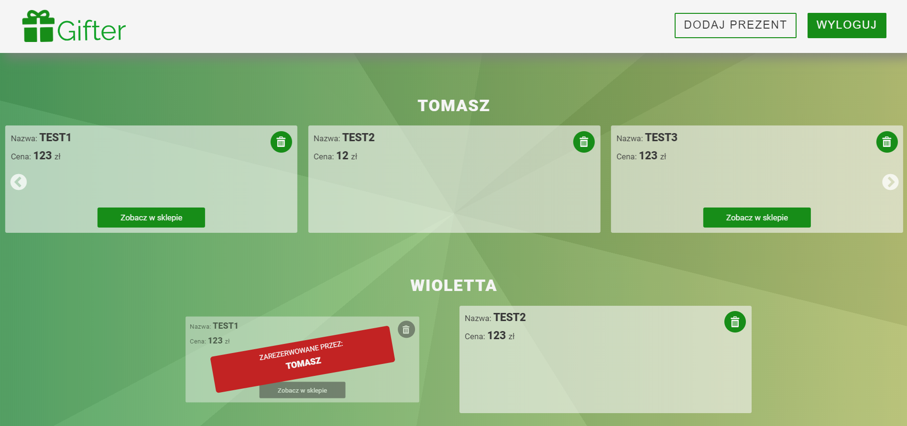

# Shopping List

This React project was made to teach me how to work with firebase.
It was made with **mobile first** approach.

In order to see a demo visit [this link](https://tompod92.github.io/Gifter)



---

## About the App

It is ment to keep track of various gift ideas for different members of my family. Everytime someone has an idea for what he/she would like to get for upcoming christmas/birthday he can add that to a database.
So when it is time to get a gits for someone and you do not have an idea you could look for it in the app.
In order to use this application yo have to be logged in with your google account.
After that you are allowed to view/add/book and delete gifts from the app.
You wont be able to see that someone booked your gift because that would spoil the suprise, would it? ;)

---

## In order to few the source code download/clone this repository

```bash
npm install
npm run start
```
